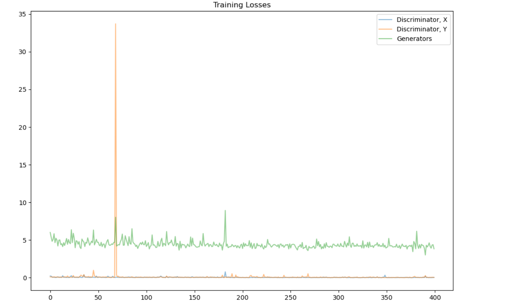
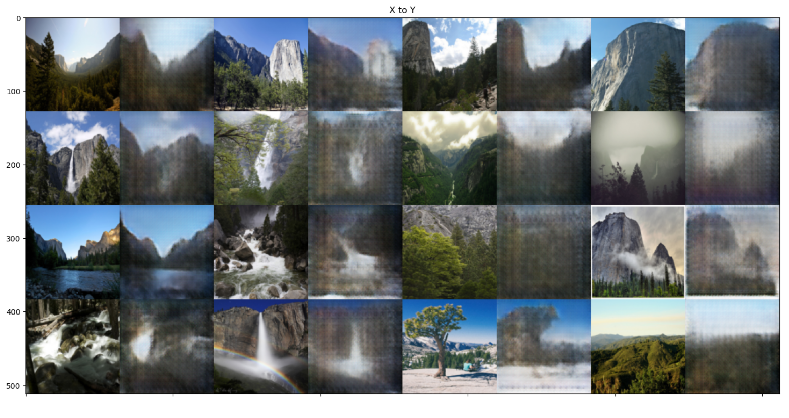
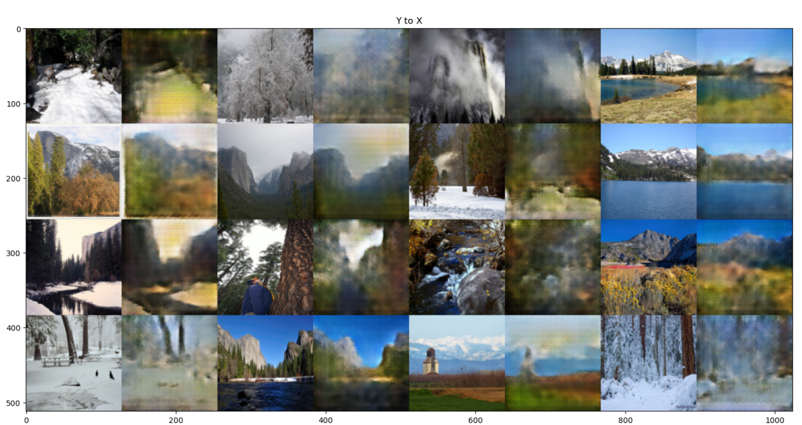

# Image Translation With CycleGAN

This project demonstrates images translation, from one domain (Summer) to another(winter), and vice versa, using cycleGAN and pytorch. 

# Training Loss

# Result

